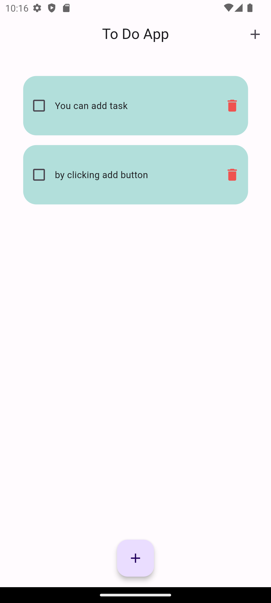

# To-Do App

This project is a mobile to-do application developed using Flutter. It helps users to manage their tasks efficiently on their mobile devices.

## Features

- Add and delete tasks. (Simple)
- Mark tasks as complete.
- User-friendly interface with intuitive controls.

## Screenshots



## Installation

1. Clone this repository:
   ```bash
   git clone https://github.com/bahadirtrkalioglu/to-do-mobile-app.git
   ```
2. Navigate to the project directory:
  ```bash
  cd to-do-mobile-app
  ```
3. Install dependencies:
  ```bash
  flutter pub get
  ```
4. Run the application:
  ```bash
    flutter run
  ```

## License

This project is licensed under the GNU General Public License version 3.0 (GPL-3.0). See the LICENSE file for details.
### Contributing

    If you encounter any issues or have suggestions for improvements, please open an issue.
    Contributions are welcome! Feel free to submit pull requests.

**Acknowledgements**

    - Built with Flutter.
    - Thanks to the open-source community for their contributions and support.
